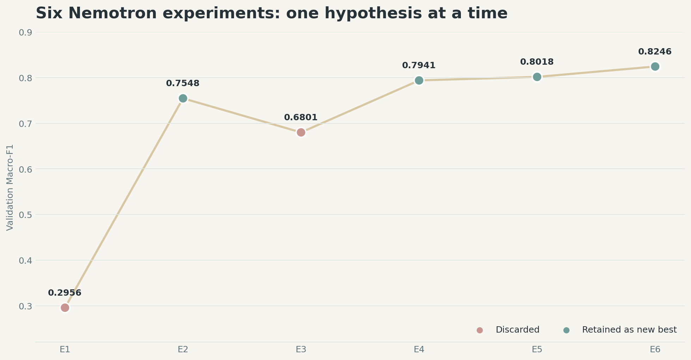
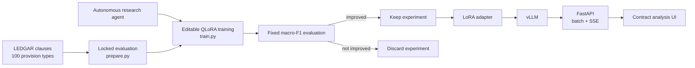

# NemoCounsel

<div align="center">

**Autonomous Nemotron fine-tuning for legal-clause classification**

[](https://www.python.org/)
[](https://huggingface.co/nvidia/Llama-3.1-Nemotron-Nano-8B-v1)
[](https://arxiv.org/abs/2305.14314)
[](https://docs.vllm.ai/)
[](https://fastapi.tiangolo.com/)
[](LICENSE)

**RTX Renegades · NVIDIA Hackathon · Track B**

</div>

NemoCounsel classifies contract clauses into the 100 provision types in
[LEDGAR](https://huggingface.co/datasets/coastalcph/lex_glue). It combines
NVIDIA's Llama 3.1 Nemotron Nano 8B model with a Karpathy-style autonomous
research loop: an agent changes one training hypothesis at a time, runs a
fixed evaluation, and keeps only measurable improvements.

The final accepted configuration reached **0.8246 macro-F1**, **91.50%
accuracy**, and **0 unparsed responses** on the fixed 200-clause validation
slice.



Read the illustrated, reproducible research report:
**[I Fine-Tuned an 8B AI to Read Legal Contracts—Here’s How It Actually
Works](autoresearch/nemotron/medium_report/nemocounsel-autoresearch.md)**.

## Why NemoCounsel

Legal-clause datasets are highly imbalanced, so accuracy alone can hide poor
performance on rare provisions. NemoCounsel optimizes macro-F1, giving every
clause type equal weight. The evaluation prompt, label parser, validation
slice, seed, and metric are locked in `prepare.py`; the research agent may
change only `train.py`.



## Results

The publication-ready six-experiment Nemotron sequence is preserved in
[`nemotron_experiments.tsv`](autoresearch/nemotron/medium_report/data/nemotron_experiments.tsv),
including each keep/discard decision. The runner's source ledger and scored
execution log remain available under `autoresearch/nemotron/`.

| Experiment | Macro-F1 | Accuracy | Unparsed | Decision |
|---|---:|---:|---:|---|
| Initial Nemotron full-data run | 0.2956 | 0.5300 | 52/200 | Discarded |
| Preserve target labels with 768-token context | 0.7548 | 0.8750 | 0/200 | Kept |
| One-epoch cosine schedule | 0.6801 | 0.8450 | 0/200 | Discarded |
| Complete two-epoch schedule | 0.7941 | 0.9000 | 0/200 | Kept |
| Extend LoRA to MLP projections | 0.8018 | 0.9050 | 0/200 | Kept |
| Increase expanded-adapter rank to 32 | **0.8246** | **0.9150** | **0/200** | **Kept** |

The reported values are hackathon experiment results on a deterministic
200-example validation slice, not a claim of production or legal reliability.

## Repository layout

```text
autoresearch/nemotron/  Nemotron QLoRA loop and complete result history
baselines/bert/         Lightweight BERT GPU autoresearch baseline
notebooks/              Dataset, metrics, and fine-tuning notebooks
serving/                vLLM launcher and FastAPI classification bridge
docs/                   Architecture and deployment documentation
assets/results/         Hackathon-ready experiment visualizations
```

## Reproduce the Nemotron experiment

An NVIDIA GPU with sufficient VRAM is required for the full run.

```bash
cd autoresearch/nemotron
python3 -m venv .venv
source .venv/bin/activate
pip install -r requirements.txt
python -c "import torch; print(torch.cuda.is_available())"
bash run_experiment.sh
```

The first run downloads `nvidia/Llama-3.1-Nemotron-Nano-8B-v1`. The accepted
configuration trains on 60,000 clauses with 4-bit NF4 quantization and a
rank-32 LoRA adapter over the attention and MLP projections. It writes the
reproducible adapter to `autoresearch/nemotron/adapters/ledgar-best/`; adapter
weights are intentionally excluded from Git.

To continue autonomous research, open an agent session in
`autoresearch/nemotron`, read `program.md`, and test one hypothesis at a time.

## Serve the model

After reproducing or supplying an adapter:

```bash
export BASE_MODEL=nvidia/Llama-3.1-Nemotron-Nano-8B-v1
export ADAPTER_PATH="$PWD/autoresearch/nemotron/adapters/ledgar-best"
bash serving/serve_vllm_lora.sh
```

In a second terminal:

```bash
pip install fastapi uvicorn openai
uvicorn serving.api:app --host 0.0.0.0 --port 8003
```

The bridge exposes:

| Method | Endpoint | Purpose |
|---|---|---|
| `GET` | `/health` | Runtime health and backend information |
| `POST` | `/classify` | Classify all extracted clauses as JSON |
| `POST` | `/classify/stream` | Stream clause results as server-sent events |

See [deployment.md](docs/deployment.md) for configuration and request examples.

## Reproducibility and artifacts

- `prepare.py` fixes the dataset, seed, validation slice, prompt, parser, and
  macro-F1 calculation.
- `all_attempts.tsv` preserves accepted and rejected hypotheses.
- `results.tsv` preserves scored runs associated with the research history.
- Model weights, adapters, local environments, caches, and raw logs are not
  committed. They can be regenerated from the source and recorded settings.

## Limitations

- NemoCounsel is a research prototype, not legal advice.
- The headline validation contains 200 clauses; a larger held-out evaluation
  is required before deployment.
- Clause splitting in the API is intentionally simple and should be replaced
  with a document-aware parser for production contracts.
- Base-model and dataset licenses and terms remain separate from this
  repository's code license.

## Team and acknowledgements

Built by **RTX Renegades** for **NVIDIA Hackathon Track B**. The project uses
NVIDIA Nemotron, the LEDGAR configuration of LexGLUE, Hugging Face
Transformers/PEFT, vLLM, FastAPI, and the experimental spirit of Andrej
Karpathy's [`autoresearch`](https://github.com/karpathy/autoresearch).

## License

Repository code and documentation are available under the [MIT License](LICENSE).
Third-party models and datasets retain their respective licenses and terms.
