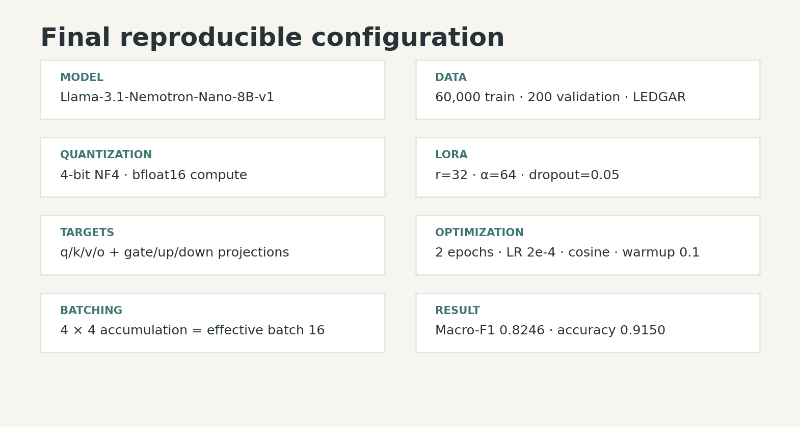
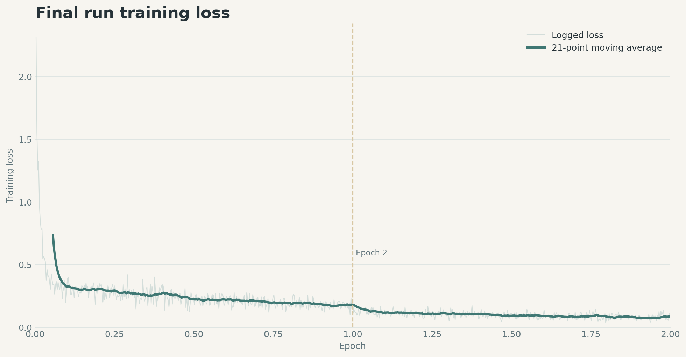

# From 0.2956 to 0.8246 Macro-F1: Autoresearching an 8B Legal Clause Classifier

*How we used six controlled experiments, 4-bit LoRA, and a strict keep-or-discard loop to adapt NVIDIA’s Nemotron Nano 8B to LEDGAR.*

> **Result:** our validation Macro-F1 rose from **0.2956 to 0.8246**, while exact-match accuracy reached **91.5%** and all 200 validation responses became parseable. This article reports only the six Nemotron experiments.

The complete implementation is open source in the
[NemoCounsel GitHub repository](https://github.com/RittikaJ/nemocounsel).
The repository includes the
[Nemotron training workflow](https://github.com/RittikaJ/nemocounsel/tree/main/autoresearch/nemotron),
the experiment ledgers, and the scripts needed to reproduce the run.


## The problem

Contracts are long, repetitive, and full of clauses whose meaning depends on precise legal language. Our task was to map each input clause to one of the 100 categories in LEDGAR, a contract-provision dataset distributed with the [LexGLUE legal-language benchmark](https://arxiv.org/abs/2110.00976).

We treated classification as constrained generation: the model saw an instruction, the list of valid categories, and the clause text, then generated one category name. That made formatting part of model quality. A semantically plausible answer still counted as unparsed if it could not be mapped to a valid label.

The base model was [NVIDIA Llama-3.1-Nemotron-Nano-8B-v1](https://huggingface.co/nvidia/Llama-3.1-Nemotron-Nano-8B-v1). We adapted it with [LoRA](https://arxiv.org/abs/2106.09685) and loaded the backbone in 4-bit NF4, following the memory-efficient approach popularized by [QLoRA](https://arxiv.org/abs/2305.14314). The result is an adapter rather than another full copy of an 8B-parameter model.

## The research loop

The workflow borrowed its discipline from Andrej Karpathy’s [autoresearch](https://github.com/karpathy/autoresearch): change one idea, run the whole evaluation, and let the metric decide whether that change survives.

For each experiment we:

1. wrote one testable hypothesis;
2. changed `train.py` and kept its description meaningful;
3. trained through `bash run_experiment.sh`;
4. read the printed validation Macro-F1;
5. retained the change only when it improved the best score.

This matters because a plausible modification is not automatically an improvement. Experiment 3 in the public sequence—reducing training to one epoch—lowered Macro-F1 from 0.7548 to 0.6801, so it was discarded.

## What changed across the six experiments

| Experiment | Hypothesis tested | Macro-F1 | Accuracy | Decision |
|---:|---|---:|---:|---|
| 1 | Nemotron 8B, 4-bit LoRA, 60k training examples | 0.2956 | 0.5300 | Discarded |
| 2 | Retain target labels during truncation; use 768-token context | 0.7548 | 0.8750 | Kept |
| 3 | Complete a one-epoch cosine schedule | 0.6801 | 0.8450 | Discarded |
| 4 | Train for two epochs without an internal cutoff | 0.7941 | 0.9000 | Kept |
| 5 | Extend LoRA from attention into MLP projections | 0.8018 | 0.9050 | Kept |
| 6 | Increase expanded-adapter rank from 16 to 32 | **0.8246** | **0.9150** | **Kept** |

The decisive improvement was not a larger rank or another epoch. It was fixing the input-target construction. With naïve truncation, the target tokens could be clipped off, leaving the model without a supervised answer to learn. Reserving space for the target and truncating only the prompt moved Macro-F1 by **+0.4592** in one experiment.

Two epochs then recovered another **+0.0393** over that retained checkpoint. Expanding adapter coverage to the MLP projections helped modestly, and raising LoRA rank to 32 produced the best final score.

## Final configuration



The backbone was quantized with NF4 and bfloat16 compute using the `bitsandbytes` 4-bit linear layers documented by [Hugging Face](https://huggingface.co/docs/bitsandbytes/main/en/reference/nn/linear4bit). The final adapter targeted `q_proj`, `k_proj`, `v_proj`, `o_proj`, `gate_proj`, `up_proj`, and `down_proj`. The PEFT parameters correspond directly to the documented [`LoraConfig`](https://huggingface.co/docs/peft/main/package_reference/lora).

```python
MODEL_NAME = "nvidia/Llama-3.1-Nemotron-Nano-8B-v1"
TRAIN_SIZE = 60_000
MAX_LENGTH = 768

LORA_R = 32
LORA_ALPHA = 64
LORA_DROPOUT = 0.05
LORA_TARGET_MODULES = [
    "q_proj", "k_proj", "v_proj", "o_proj",
    "gate_proj", "up_proj", "down_proj",
]

EPOCHS = 2
BATCH_SIZE = 4
GRAD_ACCUM_STEPS = 4
LEARNING_RATE = 2e-4
```

The effective batch size was 16. We used a cosine learning-rate schedule with a 10% warmup, seed 42, and a maximum of 16 newly generated tokens during evaluation.

## What the loss curve tells us



The final run completed 7,500 optimizer steps across two epochs. Its Trainer summary reported a mean training loss of **0.1805** and a runtime of about **18,305 seconds (5 h 05 m)**. The chart contains every loss record recoverable from the final raw log, plus a 21-point moving average; the underlying values are published as `data/final_training_history.tsv`.

Loss is useful for checking optimization, but it was not the selection metric. The autoresearch loop selected experiments using validation Macro-F1 because class imbalance makes raw accuracy incomplete. Scikit-learn defines [Macro-F1](https://scikit-learn.org/stable/modules/generated/sklearn.metrics.f1_score.html) as the unweighted mean of per-class F1 values, giving each evaluated class equal influence.

## Reproduce the experiment

The complete code and logs belong in the [NemoCounsel repository](https://github.com/RittikaJ/nemocounsel). The exact entry points are
[`train.py`](https://github.com/RittikaJ/nemocounsel/blob/main/autoresearch/nemotron/train.py),
[`run_experiment.sh`](https://github.com/RittikaJ/nemocounsel/blob/main/autoresearch/nemotron/run_experiment.sh), and
[`all_attempts.tsv`](https://github.com/RittikaJ/nemocounsel/blob/main/autoresearch/nemotron/all_attempts.tsv).
For a faithful rerun, use an NVIDIA CUDA GPU and record the GPU model, driver, CUDA version, Python version, dependency versions, and immutable model/dataset revisions.

```bash
git clone https://github.com/RittikaJ/nemocounsel.git
cd nemocounsel/autoresearch/nemotron

python -m venv .venv
source .venv/bin/activate
pip install -r requirements.txt

python -c "import torch; print(torch.__version__, torch.version.cuda)"
python -c "import torch; print(torch.cuda.is_available(), torch.cuda.get_device_name(0))"

bash run_experiment.sh
```

For stronger provenance, pin the Hugging Face assets instead of relying on moving defaults. The model card exposes commit-addressable files, and the Datasets loader supports a `revision` argument in its [loading API](https://huggingface.co/docs/datasets/loading):

```python
MODEL_REVISION = "485e5fa4b2ee7ff4a2bf78b8582251a49527f45d"
DATASET_REVISION = "fe9d5f8f254c32c0d9c343e86534523deb2fcb01"

tokenizer = AutoTokenizer.from_pretrained(
    MODEL_NAME, revision=MODEL_REVISION
)
dataset = load_dataset(
    "coastalcph/lex_glue",
    "ledgar",
    revision=DATASET_REVISION,
)
```

Reproducibility on GPUs is not an absolute promise. PyTorch explicitly notes that identical results are not guaranteed across releases, platforms, or CPU/GPU execution, even with the same seed; its [reproducibility guide](https://docs.pytorch.org/docs/stable/notes/randomness) explains the deterministic controls and their performance trade-offs. Report both seeds and the complete environment.

## Rebuild this article and its visuals

The report is generated from the experiment ledger and checked-in final-run
training history. If a local `last_run.log` is available, the builder reparses
it and refreshes the derived training-history file:

```bash
cd nemocounsel/autoresearch/nemotron
python3 medium_report/build_report.py
```

That command regenerates:

- `data/nemotron_experiments.tsv`, containing only the six Nemotron experiments;
- `data/final_training_history.tsv`, parsed from `last_run.log` when available
  and otherwise reused as the checked-in reproducibility artifact;
- all report graphics;
- a self-contained HTML file with embedded images.

The source ledger retains its original experiment IDs for auditability, while the article renumbers the Nemotron-only sequence from one to six. No other model or baseline is included in the narrative, figures, or derived report data.

## Limitations—and what we would do next

The headline score is a **200-example validation result**, not an untouched test-set result. It was consulted repeatedly while choosing hypotheses, so it may overestimate performance on genuinely unseen contracts. The next scientific step is to freeze the final configuration and evaluate exactly once on a held-out test split.

There is another metric detail worth making explicit: Macro-F1 should be computed with the intended fixed label universe when reporting a 100-class task. Passing `labels=range(100)` to `f1_score` prevents absent classes from silently changing the average. Future runs should also report per-class support, per-class F1, and confidence intervals.

Finally, the original best-scoring run did not preserve its adapter weights. Re-running the frozen configuration can materialize an adapter, but that new artifact must be described as a reproduction—not falsely presented as the exact historical checkpoint.

## What we learned

The largest gain came from data plumbing, not a fashionable hyperparameter. Once the target survived truncation, the model could learn the task it was supposedly being trained on. After that, longer training and broader, higher-rank adapters delivered smaller incremental gains.

That is the value of a strict research loop: it turns a sequence of guesses into an inspectable chain of evidence. Six Nemotron experiments were enough to expose one major correctness issue, reject one regression, and finish with a **0.8246 validation Macro-F1** configuration that others can rerun, audit, and improve.
